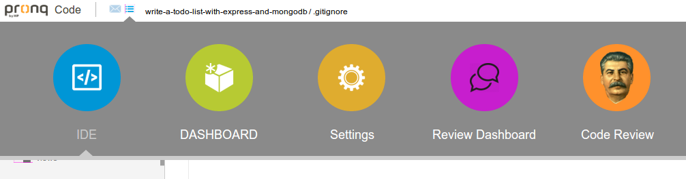
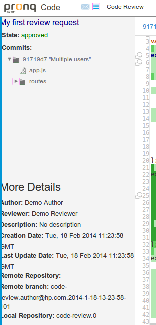
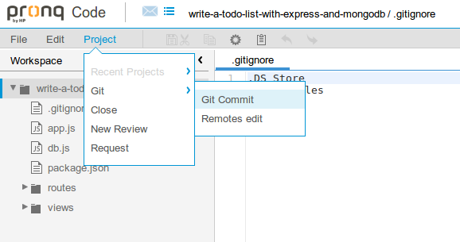

## Overview

The main achievement of the project is
[Code Review extension](#code_review_extension),
or [view on Github.com](https://github.com/korya/hp-ide-code-review-extension),
which fulfils the project
[requirements](./objectives.html#requirements).

Additionally, there are a few side projects:

 - [Notification extension](#notification_extension)
   provides a facebook-like notification service.
   [View Notification extension on Github.com](https://github.com/korya/hp-ide-notification-extension)
   
 - [Git extension](#git_extension)
   provides a very simple GIT service allowing: to commit changes, push/pull changes to/from a remote GIT server. 
    **Note**: the extension contradicts the main principle of Pronq IDE `no data is stored on server side`: it stores _all_ the data on server side. It was written to provide a revision control service, which was missing at that time in the IDE and was required for development of Code Review system.
    [View Git extension on Github.com](https://github.com/korya/hp-ide-git-extension)
    
 - [Git Rest API](#git_rest_api)
    provides a restful Git API that mimics as most as possible the old good git.
    The project was developed from scratch and published as a standalone Node.js package [git-rest-api](https://www.npmjs.org/package/git-rest-api).
    [View Git Rest API on Github.com](https://github.com/korya/node-git-rest-api)

## Code Review extension

A new code review request can be created in IDE page:
 - user can select a reviewer
 - user can select a change (commit)

Code Review extensions adds 2 new pages (open MegaMenu to see this), `Review Dashboard` and `Code Review`:

`Review Dashboard` page lists all code reviews the user is involved in (author or reviewer):

`Code Review` page is dedicated for working on a selected code review request

Left column of `Code Review` page displays the review details:
 - top half displays the review state and a file tree of changed files
 - bottom half displays other review details

Right column of `Code Review` page displays:
 - list of current comment threads
 - list of comments for a selected thread; available threads are:
    - 'Show all review comments' -- all review comments
    - 'Show review-wide comment thread' -- comments for a review as a whole, not related to any specific file
    - 'Show all file comments' -- all comments related to a specific file
    - 'Show file-wide comment thread' -- comments for a file as a whole, not related to any specific line
    - 'Show file-line comment thread' -- comments for a specific line in a specific file

Center column of `Code Review` page displays the `diff`s of changed files:
 - open files are listed at top
 - at most one selected file diff is displayed
 - Orion's Compare widget is user to show the diff
 - commented lines have a bold font and a dialog icon on the left ruler

[View Code Review extension on Github.com](https://github.com/korya/hp-ide-code-review-extension)

## Notification extension

The extension provides a very simple facebook-like notification service.
The implementation is really very basic: no message types, no aggregation of messages.
Just a list of notifications, new ones are marked as unseen;
after the notification is shown it is marked as seen, but yet remains in the list.
It is possible to clear the notification list.

[View Notification extension on Github.com](https://github.com/korya/hp-ide-notification-extension)

## Git extension

The extension consists of 2 parts:
 1. back-end running on server side and responsible for:
   - storing actual git repositories
   - providing restful API for working with GIT
   The back-end uses: [Git Rest API](#git_rest_api)
 2. front-end running on client side:
   - simple git service with exposing only minimal necessary functionality
     (which can be easily extended)
   - hooks for project page:
     * init a repo opon project creation
     * add and commit project template
   - Project GIT menu allowing:
     * manage remotes
     * commit project changes

In addition to its main goal, which is to provide git service in the application, the git extensions registers a submenu in IDE page:

[View GIT extension on Github.com](https://github.com/korya/hp-ide-git-extension)

## Git Rest API

The aim of the project is to provide a restful Git API that
mimics as most as possible the old good git.

For example, in order to commit a change in shell you should do:

$ mkdir new-project
$ cd new-project
$ git init
$ git add file.c
$ git commit -m 'A commit message'
$ git add file.c
$ git commit -m 'A second commit message'
$ git show HEAD~:file.c


In case of `git-rest-api` you should do:

POST /init
  { "repo": "new-project" }
POST /repo/new-project/tree/file.c
POST /repo/new-project/commit
  { "message": "A commit message" }
POST /repo/new-project/tree/file.c
POST /repo/new-project/commit
  { "message": "A second commit message" }
GET  /repo/new-project/show/file.c?rev=HEAD~


[View Git Rest API on Github.com](https://github.com/korya/node-git-rest-api)
