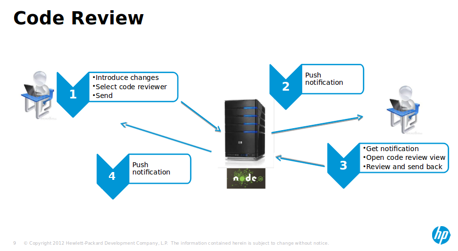

## Intro

HP Pronq is a web based IDE as a service which is fully functioning when you
are offline, with desktop-like performance, ability to connect to git and svn
on-premise repositories and the ability to keep your 
source files solely on your local device in order to protect your privacy in
addition to being fully extensible for other developers 
to enrich its functionality and share it.

## Goals

The goal of the project is to develop an integrated offline code review system
for the IDE. The system should be an extension for the IDE allowing any developer to easily
create and send a code review request to his colleagues and get a feedback.

## Requirements

#### Basic requirements

  - user should be able to select changes for review
  - server should persist the request in its DB
  - server should send a push notification to a reviewer
  - there should be a dedicated view for reviewing allowing to:
    - show file tree of changed files
    - highlight added and removed lines
    - allow navigation between changed lines
    - add inline comments
    - approve/reject the review
    - update code review

#### Enhancements

These requirements are not mandatory to implement:
  - user should be able to select a reviewer
  - integrate with source control (git or general)
  - approve/reject per change/file 

## Risks

The 2 most risky parts of the project:
  - development of extension's back-end code running on server side
  - integration of Orion's Compare widget

## Use case

The most basic use case. A developer has just finished and committed a new feature to its local repository. He has run some tests and the feature seems to work perfect. But before he pulls the changes to the main branch in the central repository, he would like to get a feedback from his colleagues.

1. So the developer creates a new code request:
   - selects the changes to be reviewed
   - selects the reviewer
   - sends the request to the server

2. The server:
   - accepts the request
   - persists the request
   - forwards the request in push notification to the review (when the reviewer is online)

3. The reviewer:
   - gets a notification and opens a review in a dedicated view:
     - file tree of the changed files is shown
     - for each changed file, its 'diff' can be shown
   - comments some lines in some files, the comment is sent back to the server
   - can either reject or accept the review, the new state is sent to the server

4. The server:
   - send a push notification to the developer
   - the developer can react

The process ends, when the reviewer either accepts or rejects the code review request.
